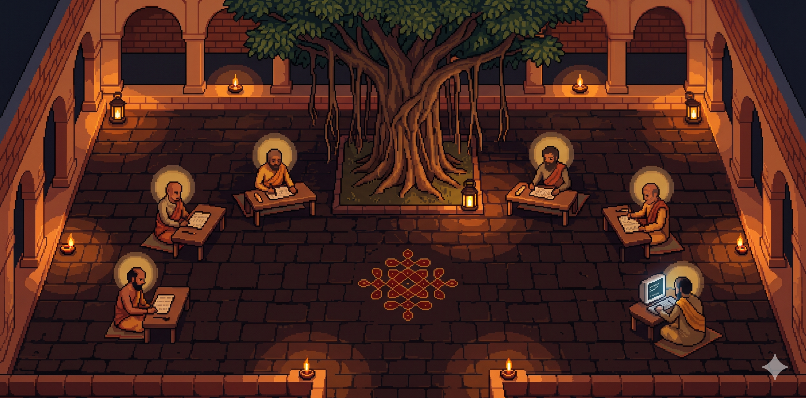
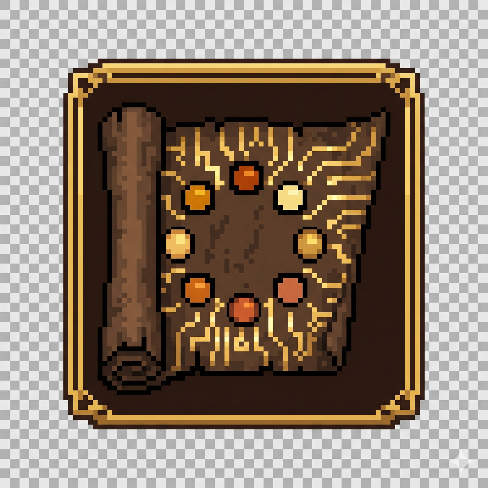
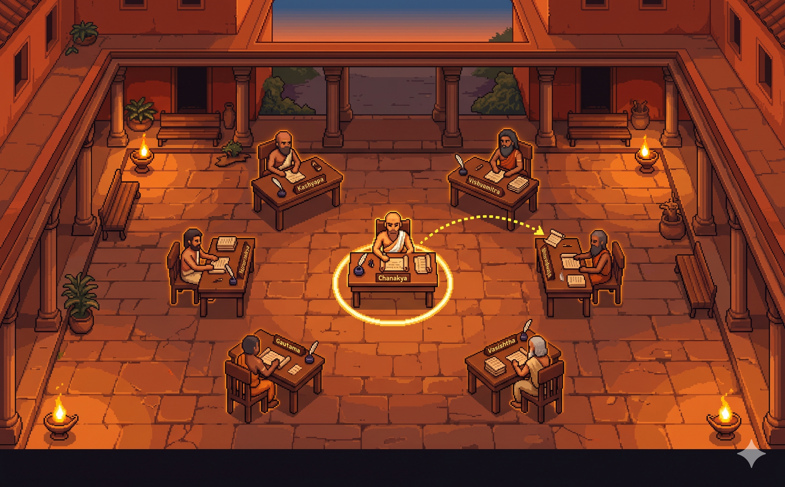
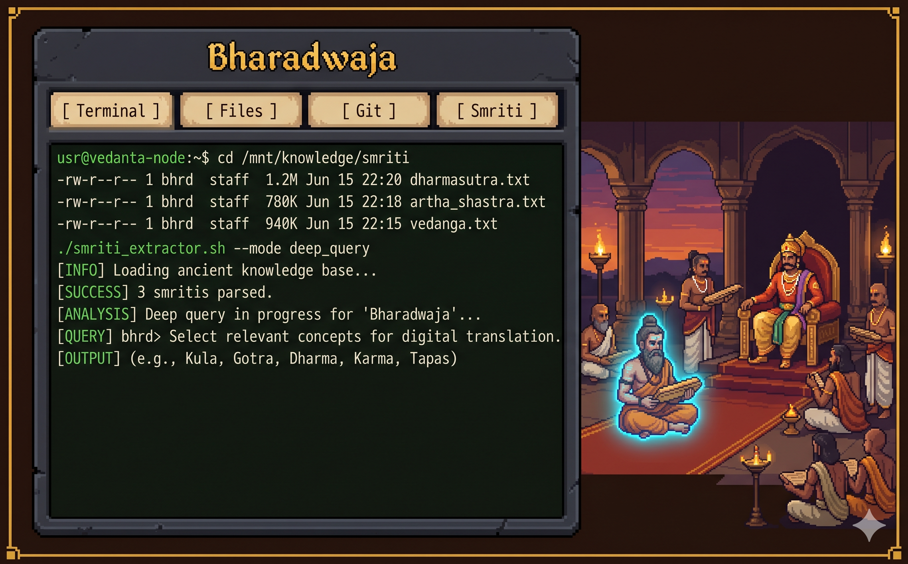
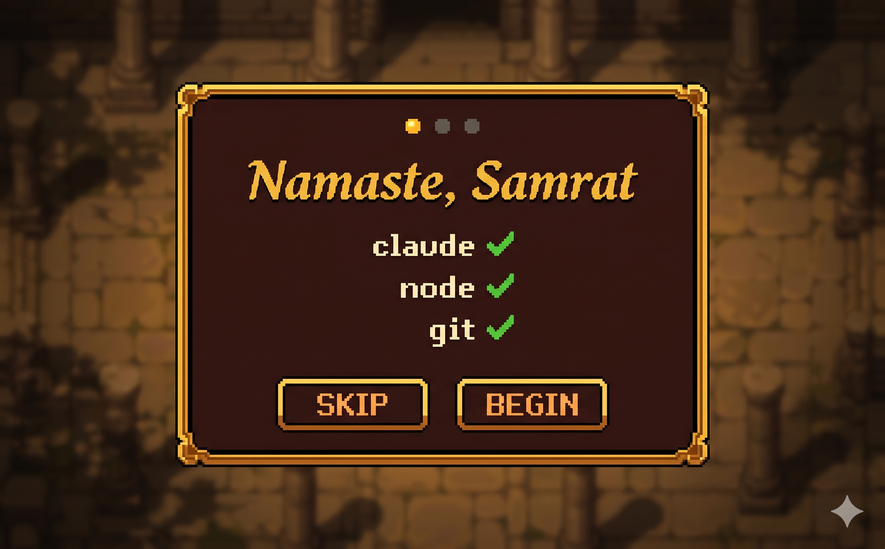

<div align="center">



<br/><br/>

# Takshashila

**Multi-agent Claude Code harness. Ancient Indian pixel-art university. Windows & macOS.**

[](https://github.com/DewashishCodes/takshashila/releases)
[](https://github.com/DewashishCodes/takshashila/releases)
[](https://www.electronjs.org/)

</div>

---

Takshashila is a desktop app that runs a full court of specialized AI agents — each living in their own terminal, file system, and memory — orchestrated by a GOD agent named **Chanakya**. You issue a mandate. The Sabha decides who handles it. You watch it happen in real time, on a pixel-art top-down court floor.

---

## What it is

Most "multi-agent" tools are invisible pipelines. Takshashila puts them on a map.

You sit as the **Samrat** — the king who issues mandates. **Chanakya**, your chief strategist, reads every aadesh (command) and routes it to the right specialist. Specialists are real Claude Code sessions with their own workspaces, terminals, and memories. When a sandesh (message scroll) flies across the court, you see it arc through the air. When an agent is working, their desk lamp pulses. When something goes wrong, Chanakya escalates back to you.

It is, at its core, a structured multi-agent Claude Code harness — with the aesthetics of a 5th-century BCE Indian university.

---

## The Sabha

<div align="center">

</div>

<br/>

Seven agents live in the court. Each is a real Claude Code session with a persona, a workspace directory, and a long-term memory file.

| Agent | Role | Speciality |
|---|---|---|
| **Chanakya** | GOD Orchestrator | Routes mandates, manages the court, escalates |
| **Aaruni** | Long-runner | Tasks that take time, retries, persistence |
| **Nachiketa** | Researcher | Web search, information gathering |
| **Gargi** | Reviewer | Code review, validation, critique |
| **Bharadwaja** | Builder | Code writing, compilation, builds |
| **Chandragupta** | Executor | Quick tasks, deployments, commands |
| **Vishnu Sharma** | Scribe | Documentation, reports, explanations |

You can also **summon new shishyas** — custom agents with a name, domain, and persona — without restarting the app.

---

## Features

<table>
<tr>
<td width="50%" valign="top">

### Live Court Floor

A Pixi.js pixel-art top-down scene where every agent walks to their desk, wanders the courtyard, and hurries home when work arrives. Select an agent by clicking. Watch sandesh scrolls arc between desks in real time.

</td>
<td width="50%">



</td>
</tr>
<tr>
<td width="50%">



</td>
<td width="50%" valign="top">

### Full Per-Agent Workspaces

Every agent gets their own xterm.js terminal, file browser with CodeMirror editor, git status pane, and editable memory file. The terminal stays live when you switch tabs — no dropped sessions.

</td>
</tr>
<tr>
<td width="50%" valign="top">

### Chanakya Orchestrates

Issue a mandate in the Aadesh bar. Chanakya reads it, reasons about who should handle it, and delivers it. Approvals surface as Anumati requests — you see them, approve or deny, and the agent continues.

</td>
<td width="50%" valign="top">

### Agent Memory (Smriti)

Each agent maintains a persistent `smriti.md` — long-term memory that Claude Code reads on session start. Edit it live from the panel. A 2,000-word soft cap keeps context focused and costs reasonable.

</td>
</tr>
</table>

---

## Getting Started

### Requirements

- **Windows 10/11** (primary) or **macOS 12+**
- **Node.js 18+** on PATH
- **Git** on PATH
- **Claude Code CLI** (`claude`) on PATH — [install here](https://claude.ai/code)
- **Visual Studio Build Tools** with C++ workload (Windows only, for node-pty)

### Install

Download the latest installer from [Releases](https://github.com/DewashishCodes/takshashila/releases):

- **Windows:** `Takshashila-Setup-x.x.x.exe` (NSIS installer)
- **macOS:** `Takshashila-x.x.x.dmg`

Run it. The onboarding wizard checks your environment on first launch.

<div align="center">
<br/>

<br/><br/>
</div>

### First session

1. Launch Takshashila.
2. The wizard verifies `claude`, `node`, and `git` are on PATH.
3. The court floor opens. Agents walk to their desks.
4. Type a mandate in the **Aadesh bar** at the top and press Enter.
5. Chanakya takes it from there.

---

## How it works

```
You (Samrat)
  → Aadesh bar (mandate)
      → Chanakya (GOD agent, Claude Code session)
          → routes via sandesh (file-based message)
              → Specialist shishya (Claude Code session)
                  → works in their kshetra (workspace dir)
                  → reports back via sandesh
              → Chanakya summarizes / escalates
          ↑ Anumati (approval) surfaced if needed
  ← Result in Chanakya's terminal
```

All inter-agent messaging is file-based — no fragile output parsing. Each agent's workspace has a `CLAUDE.md` persona file, an inbox, an outbox, and a `smriti.md` memory. A hook server on a named pipe delivers lifecycle events (tool use, stops, session starts) so agent status is accurate without polling.

---

## Building from source

```bash
git clone https://github.com/DewashishCodes/takshashila
cd takshashila
npm install
# Windows only — rebuild node-pty for Electron
npx @electron/rebuild -f -w node-pty
npm run dev
```

> **Windows node-pty note:** After `npm install`, node-pty requires three patches to `deps/winpty/src/winpty.gyp` before the rebuild succeeds. See [`CLAUDE.md`](CLAUDE.md#node-pty-windows-build--known-patches) for the exact steps.

```bash
npm run build    # production build
```

---

## Sabha data location

| Platform | Path |
|---|---|
| Windows | `%APPDATA%\Takshashila\sabha\` |
| macOS / Linux | `~/.takshashila/sabha/` |

The sabha directory holds agent identities, mailboxes, workspaces, the shared blackboard, and the append-only itihas event log. You can inspect or edit files directly — the app watches them live.

---

## Terminology

| Sanskrit | Meaning |
|---|---|
| Samrat | You — the king who issues mandates |
| Chanakya | The GOD orchestrator |
| Shishya | A specialist AI agent |
| Aadesh | A mandate / command |
| Sandesh | A message scroll between agents |
| Smriti | An agent's long-term memory |
| Anumati | An approval request |
| Avastha | An agent's current status |
| Sabha | The shared council layer (state + mailboxes) |
| Itihas | The append-only event chronicle |

---

## Roadmap

| Milestone | Status |
|---|---|
| Scaffold — Electron + React + design tokens | ✅ Done |
| Real terminals — node-pty + xterm.js | ✅ Done |
| Sabha layer — mailboxes, blackboard, itihas | ✅ Done |
| Chanakya — GOD agent, aadesh bar, anumati | ✅ Done |
| Hook server — lifecycle events via named pipe | ✅ Done |
| Court floor — Pixi.js scene, avatars, camera | ✅ Done |
| Animations — lamp overlay, scroll arc, A* walk | ✅ Done |
| Detail panel — terminal/files/git/smriti tabs | ✅ Done |
| Polish — onboarding, search, add-shishya flow | ✅ Done |
| **Packaging — NSIS installer, release** | 🔲 Next |

---

## Stack

Electron 30 · React 18 · TypeScript · Pixi.js v7 · xterm.js 5 · node-pty · Zustand · CodeMirror 6 · isomorphic-git · better-sqlite3 · electron-vite · electron-builder

---

<div align="center">

Made with obsession by [DewashishCodes](https://github.com/DewashishCodes)

*"न हि ज्ञानेन सदृशं पवित्रमिह विद्यते"*
*"There is nothing as pure as knowledge"* — Bhagavad Gita 4.38

</div>
